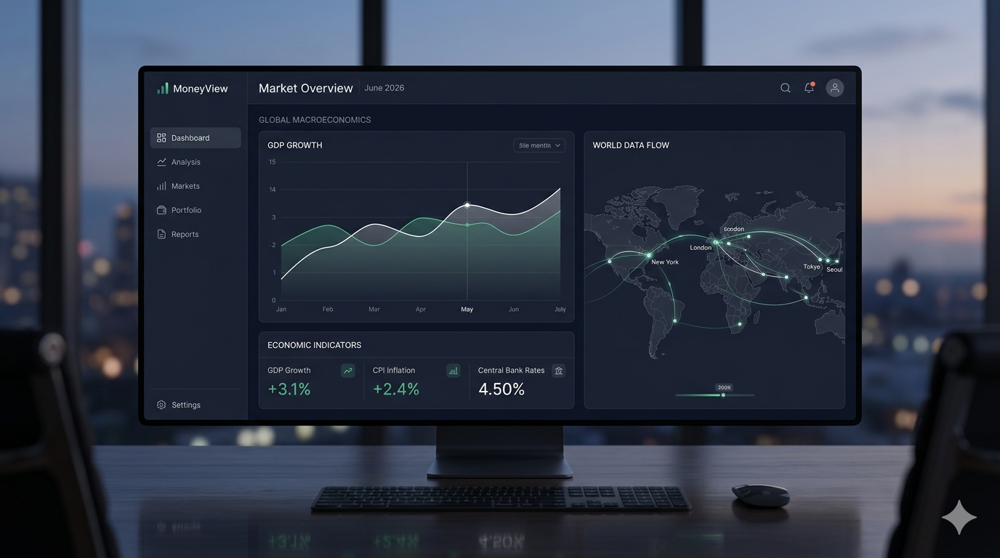
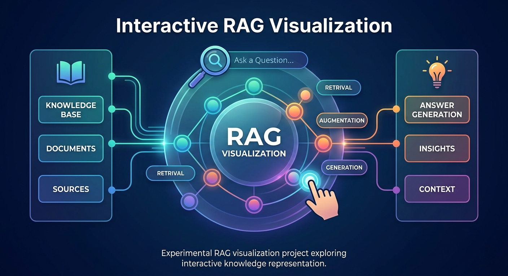

<!-- ========================================= -->
<!-- HERO SECTION -->
<!-- ========================================= -->

<div align="center">

# Ven Caesar

### AI Infrastructure • Cloud Engineering • DevSecOps Journey


<br/>

> **“Deep dive. Fast pass in.”**

<br/>

[](https://caeser07.netlify.app/)
[](https://www.linkedin.com/in/jaehwan-park-4005673b9/?locale=en-US)
[](https://github.com/probationer070)

</div>

---

# ⚡ About Me

```yaml
name: Jaehwan Park
nickname: Ven Caesar
role: AI Infrastructure & Cloud Engineering
focus:
  - Cloud Infrastructure
  - AI Systems
  - DevSecOps
  - Realtime Orchestration
  - Latency Optimization
currently_building:
  - deployment-focused cloud projects
  - realtime AI orchestration systems
  - scalable infrastructure foundations
```

---

# Brand Story

After the explosion of AI systems and the flood of synthetic information online, I became deeply interested in how infrastructure, security, and intelligent systems will shape the future.

I’m especially interested in:
- realtime AI orchestration
- scalable cloud infrastructure
- automation pipelines
- observability
- latency optimization
- AI + security ecosystems

I enjoy solving engineering problems around:

> architecture, orchestration, latency, and systems design.

Currently building toward:

### **AI Infrastructure + Cloud + DevSecOps**

---

# 🚀 Featured Projects

<br/>
<table>
<tr>

<td width="33%" valign="top">

## [RIDI](https://github.com/probationer070/RIDI)


<p align="center">
  
</p>

### Realtime AI Agent

Local AI orchestration system focused on realtime pipelines, memory systems, and latency optimization.

### 🛠 Stack
`Python` `Docker` `LLM` `Vector DB`

</td>

<td width="33%" valign="top">

## [MoneyView](https://github.com/probationer070/MoneyView)

<p align="center">
  
</p>

### Economic Analysis Platform

Automated macroeconomic visualization and structured analytical logging platform.
<b>

### 🛠 Stack
`Python` `Analytics` `Visualization`

</td>

<td width="33%" valign="top">

## [TestRAG](https://github.com/probationer070/TestRAG)

<p align="center">
  
</p>

### Interactive RAG Visualization

Experimental RAG visualization project exploring interactive knowledge representation.

### 🛠 Stack
`Python` `RAG` `Three.js`

</td>

</tr>
</table>

---

# Skill Stack

<div align="center">

## Infrastructure & Cloud


## Development & Automation


## CI/CD & Tooling


</div>

---

# Currently Learning

```txt
→ AWS Infrastructure Deployment
→ DevSecOps Foundations
→ CI/CD Automation
→ Cloud-Native Architecture
→ Infrastructure as Code
→ Observability & Monitoring
→ Scalable AI Systems
```

---

# GitHub Analytics

<div align="center">

[](https://git.io/streak-stats)

</div>
